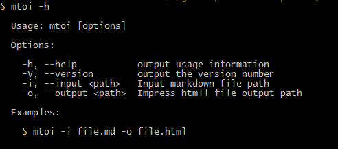

<!-- x=1500 y=500 z=1500 -->
# Markdown-Impress

-----------------------------
<!-- x=500 y=0 scale=0.5 -->
## What is it
*markdown-impress* is a tool to convert markdown to impress page.

-----------------------------
<!-- x=2500 y=0 -->
## How to install
+ Firstly you should install [nodejs](http://nodejs.org)
+ Then install it use `$ npm install -g markdown-impress`

-----------------------------
<!-- x=3000 y=1000 -->
## Markdown format
+ use `-----` to separate each slide
+ use comment to set impress attr, such as `<!-- x=0 y=0 rotate=0 -->`
+ [this page](http://steel1990.github.io/markdown-impress/) is made by *markdown-impress* use this markdown.

-----------------------------
<!-- x=1500 y=1000 rotate=90 -->
## How To Use

-------------------------------
<!-- x=0 y=1000 -->
## Use in your code

    var fs = require('fs');
    var mtoi = require('markdown-impress');
    var content = mtoi('file.md');
    fs.writeFileSync('file.html', content);