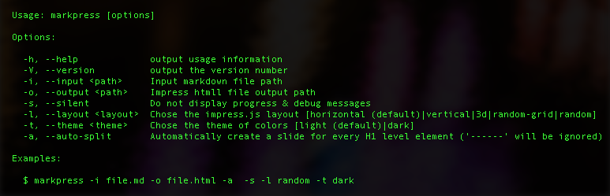

<!--markpress-opt

{
	"layout": "grid",
	"autoSplit": true,
	"sanitize": false,
	"theme": "light",
	"noEmbed": false
}

markpress-opt-->
# Grid Layout Example Markpress presentation

Welcome to the example Markpress presentation! Use your arrow keys to step through the different slides <kbd>←</kbd> <kbd>→</kbd> or swipe right/left on mobile.

This presentation was generated with the following command:

`$ markpress grid.md html/grid.html -a -l grid --save`


# Headings

## Header 2

Lorem ipsum dolor sit amet, consectetur adipiscing elit. Duis a aliquam mi. Integer eget vestibulum eros. Sed hendrerit pretium volutpat. Praesent in scelerisque quam, malesuada sodales nisl. Morbi eu ligula turpis. Integer venenatis condimentum metus at accumsan.

### Header 3

Vivamus consectetur ante dolor, vel pellentesque felis porta in. Donec feugiat condimentum metus, eget dictum dolor venenatis quis. Mauris nec tempus ligula. Vivamus euismod est ut pretium aliquet. Donec ornare quam vitae nulla convallis, in tincidunt mi auctor. Vivamus tristique ante quis semper aliquam. Cum sociis natoque penatibus et magnis dis parturient montes, nascetur ridiculus mus.

#### Header 4

Donec et scelerisque velit. Aenean pellentesque laoreet lacus at ullamcorper. Maecenas interdum orci id molestie rhoncus. Vivamus bibendum lectus a enim tincidunt tempus. Vestibulum a condimentum lorem. Cras vel ex posuere, dictum magna commodo, ullamcorper ex. Pellentesque venenatis erat et purus convallis, faucibus dignissim mi tincidunt. Sed malesuada lacus at ligula consectetur, a mollis ipsum bibendum. Proin ante leo, elementum in nisi sit amet, egestas finibus elit.


# Markup support

## Emojis!

:smile: :thumbsup: :hankey: :pizza: :camel::dash:

## And all the common markup...

**Lorem ipsum** dolor sit amet, *consectetur* adipiscing elit. **_Etiam_ iaculis sem** sit amet ultrices finibus. ~~Morbi non quam sit amet tortor volutpat convallis~~. `Curabitur egestas sit amet ante ut ultricies`.

# Code Syntax and Highlighting

## JavaScript (even ES2015)

```javascript
var hello = (s) => {
  console.log(`Hello ${s}`);
}
hello('world');
```

## Java

```java
public static void main(String[] args) {
  System.out.println("Hello, World");
}
```

## C

```c
main()
{
  printf("Hello World");
}
```

# Lists

## Unordered

- This is an:
    - Unordered list
    - With
        - Several nested levels

## Ordered

1. First
2. Second
    1. Two point one
    2. Two point two
        1. Two point two point one

## Mixed

1. An ordered list
    - With a nested
        - unordered list
2. The end

# Quotes

## Multi-line

> Donec feugiat ligula dolor, elementum mollis ipsum vulputate sit amet.
> Nam tellus sem, semper eget velit a, placerat laoreet sapien.
> Class aptent taciti sociosqu ad litora torquent per conubia nostra, per inceptos himenaeos.
> Vivamus a dolor dictum, consectetur tellus at, faucibus est.

## Single-line quote

> Donec feugiat ligula dolor, elementum mollis ipsum vulputate sit amet. Nam tellus sem, semper eget velit a, placerat laoreet sapien. Class aptent taciti sociosqu ad litora torquent per conubia nostra, per inceptos himenaeos. Vivamus a dolor dictum, consectetur tellus at, faucibus est.


# Links

- [Google](http://gamell.io)
- [Cool pictures  by myself](http://500px.com/gamell)
- A regular URL will also be turned into a clickable link: http://wikipedia.org


# Embedded Images

## Local



## Remote


# You can also embed maps, or any HTML actually

<div align="center">
  <iframe src="https://www.google.com/maps/embed?pb=!1m18!1m12!1m3!1d23297.348831365667!2d-122.45777265919516!3d37.771152643431215!2m3!1f0!2f0!3f0!3m2!1i1024!2i768!4f13.1!3m3!1m2!1s0x80859a6d00690021%3A0x4a501367f076adff!2sSan+Francisco%2C+CA!5e0!3m2!1sen!2sus!4v1462856808198" width="80%" height="800" frameborder="0" style="border:0" allowfullscreen></iframe>
</div>

Be careful, you can break the presentation if you write the wrong HTML :smiley:

# The end
